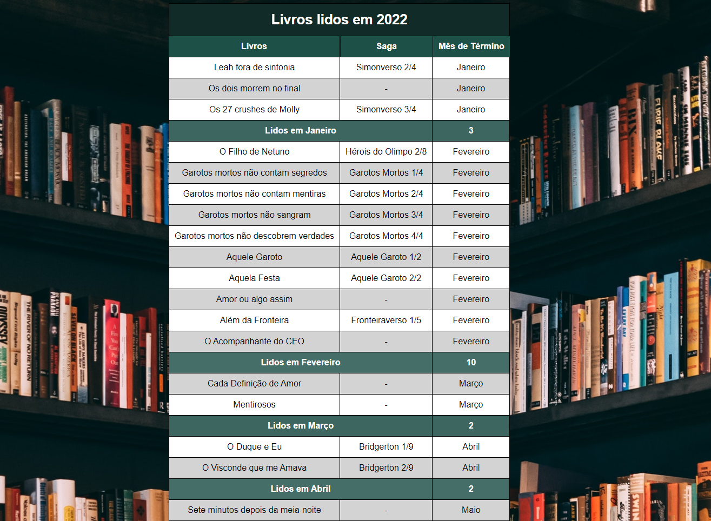

# Projeto: Livros 2022



## Descrição do Projeto
<p> Tabela pessoal de livros lidos em 2022. </p>

## 🚀 Tecnologias utilizadas
- ``HTML``
- ``CSS``

## :memo: Licença

Esse projeto está sob a licença MIT.

## 🔗 Link para o site

```
https://rubensgabriel.github.io/leituras2022/
```
